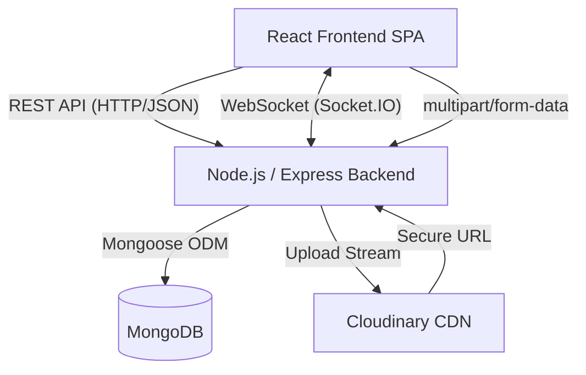

# High-Level Design (HLD)

## Overall Architecture

The Creator's Platform follows a standard decoupled Client-Server architecture. The frontend is a Single Page Application (SPA) that communicates with a stateless Node.js REST API. Real-time features are handled via a persistent WebSocket connection.

---

## Major Components

1. **Frontend (React/Vite):** Manages UI state, client-side routing, and form handling. Communicates with the backend via Axios interceptors which automatically attach JWTs.
2. **Backend (Node.js/Express):** Serves as the central API gateway. Handles business logic, authentication validation, and data formatting.
3. **Database (MongoDB):** A NoSQL database storing `users` and `posts` collections. Optimized with compound indexes for rapid feed retrieval.
4. **Cloudinary (CDN/Storage):** Remote asset storage. Receives buffered image streams from the backend and serves optimized images directly to the frontend.
5. **Authentication (JWT & bcrypt):** Decentralized session management. Tokens are signed by the backend and verified via middleware on protected routes.
6. **Socket.IO:** Enables bi-directional communication. The server pushes events to clients (e.g., new post alerts) without the client needing to poll the API.

---

## Data Flow

### 1. Login Flow
1. User submits email/password on the React Frontend.
2. Axios `POST` request sent to `/api/auth/login`.
3. Express controller looks up the user by email in MongoDB.
4. `bcrypt` compares the hashed password.
5. On success, Express signs a JWT with the user's `_id`.
6. API returns the JWT and user metadata.
7. Frontend AuthContext stores the token in `localStorage` and updates global state.

### 2. Create Post Flow
1. Authenticated user submits the post form.
2. Axios sends a `POST` to `/api/posts` with the Bearer JWT.
3. `auth.js` middleware intercepts, verifies JWT, and attaches the `User` object to the request.
4. `postController` validates input and creates a new document in MongoDB via Mongoose.
5. Controller accesses the global `io` instance and emits a `newPost` event to all clients.
6. HTTP 201 response is returned to the author's client.

### 3. File Upload Flow
1. User selects an image; React converts it to `FormData`.
2. Axios `POST` to `/api/upload`.
3. `multer` middleware receives the file, checks the 5MB limit, and stores it in server RAM (Buffer).
4. Express route forwards the buffer to `cloudinary.uploader.upload_stream`.
5. Cloudinary processes the image and returns a `secure_url`.
6. Express returns the URL to React, which then includes it in the "Create Post" payload.

### 4. Real-time Communication Flow
1. User logs in. React initializes `socket.io-client` passing the JWT in the `auth` handshake.
2. Server verifies the JWT via Socket.IO middleware.
3. Connection is established and logged.
4. When User A creates a post, the Express controller triggers `io.emit('newPost', data)`.
5. Users B, C, and D receive the event via their active WebSocket connection.
6. React `useEffect` listener catches the event and triggers a `react-hot-toast` UI popup.

---

## Deployment Architecture

- **Frontend:** Hosted on **Vercel**. Provides global Edge CDN caching for static HTML/JS/CSS assets.
- **Backend:** Hosted on **Render**. Runs the Node.js Express server. Configured with environment variables to connect to MongoDB and Cloudinary.
- **Database:** Hosted on **MongoDB Atlas** (Cloud). Accessed securely via connection strings.
- **Asset Storage:** **Cloudinary** handles serving and caching of all user-uploaded cover images.
- **Local Development:** A `docker-compose.yml` file is provided to orchestrate the Node server, React client, and a local MongoDB instance seamlessly.
